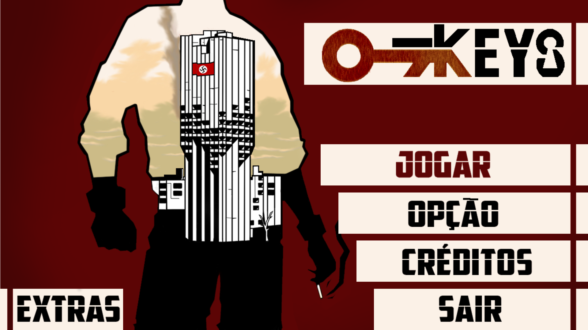
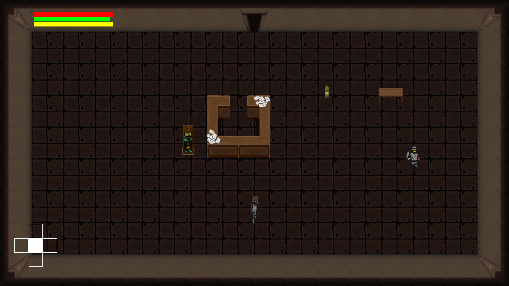
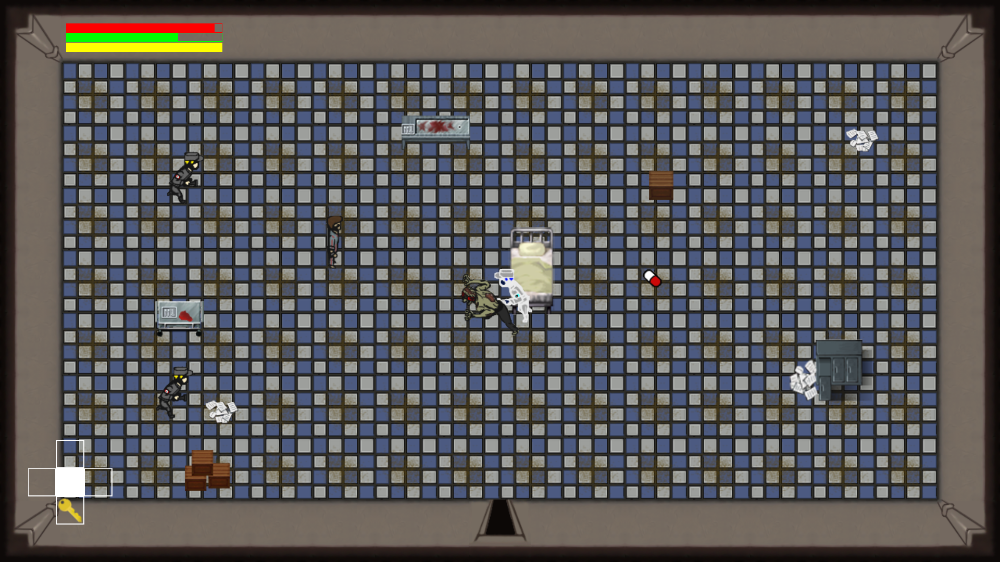

# 7 Keys

## História

O jogo conta a história de Edmond Gauthier, um sargento francês que durante a 2ª Guerra Mundial é capturado pelo exército alemão e é colocado em um sanatório para ser utilizado como moeda de troca com a França, nação inimiga da Alemanha durante a 2a Guerra. Lá ele é constantemente assombrado por fantasmas de seu passado, portanto vive sempre sobre a influência de fortes medicações.
Um dia, durante reparos no sistema de segurança do sanatório, uma pane ocorre em todo o prédio, destravando quase todas as portas das salas onde se encontra os “pacientes”. Agora - ainda sobre o efeito das medicações, sem saber direito por que ele está ali - Edmond só existe um desejo: fugir. Então inicia-se uma busca pela saída do prédio, e ao longo desse caminho, Edmond terá que enfrentar não só os guardas que estão tentando conter os prisioneiros, mas seus próprios fantasmas que insistem em assombrá-lo.

## Controles

|Botão|Ação|
|---|---|
|| Movimentar personagem na tela|
|| Correr (na direção indicada)|
|| Agachar e andar agachado (pressionando  algum botão direcional)|
|| Ataque Principal|
|| Interagir com itens|
|| Usar item|
|| Abre porta especial (ao possuir a chave)|

## Screenshoots

Menu do Jogo

Fase Inicial

Luta com Boss

